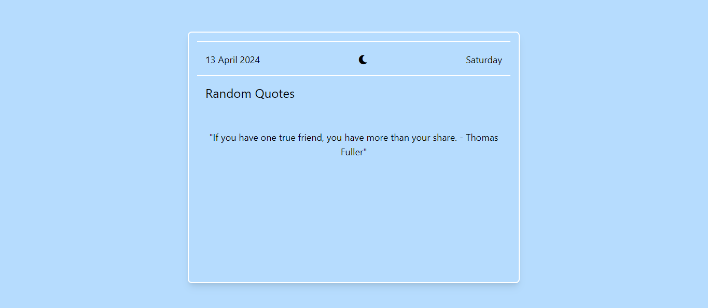

# Random Quotes App



## Description

This is a simple web application that displays random quotes fetched from the [Quotable API](https://github.com/lukePeavey/quotable). It also dynamically updates the icon based on the time of day and displays the current date and day.

## Features

- Fetches random quotes from the Quotable API.
- Updates the quote every minute.
- Dynamically changes the icon based on the time of day.
- Displays the current date and day.

## Demo

You can see a live demo of the Random Quotes App [here](https://vaibhavig12.github.io/Random_quote_generator_with_day_-_date/).

## Technologies Used

- HTML
- CSS (with Tailwind CSS for styling)
- JavaScript

## Installation

1. Clone the repository:

```bash
git clone https://github.com/vaibhavig12/random-quotes-app.git
